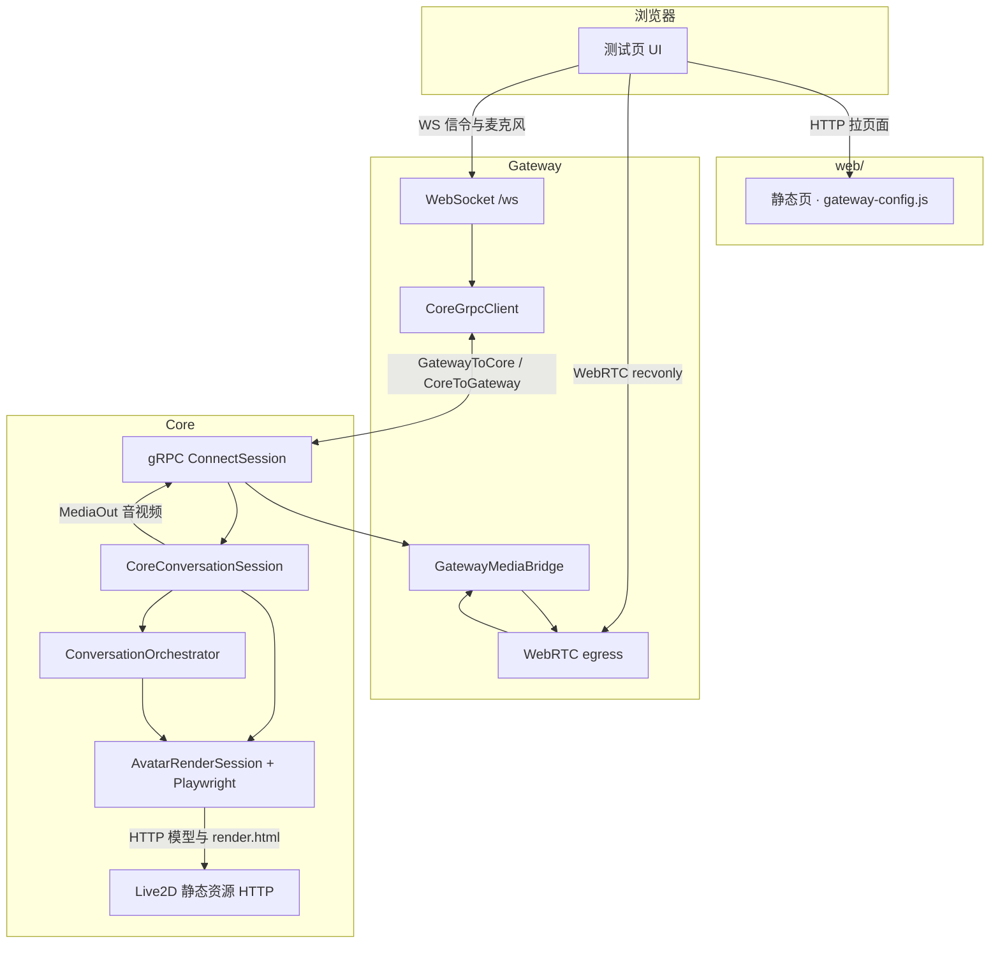
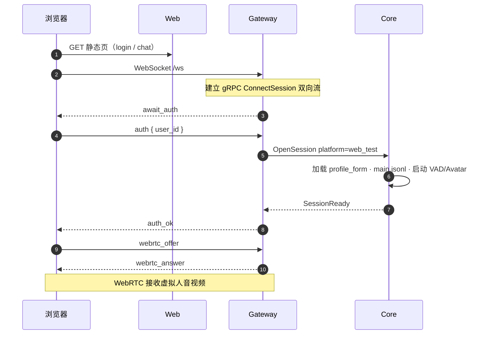
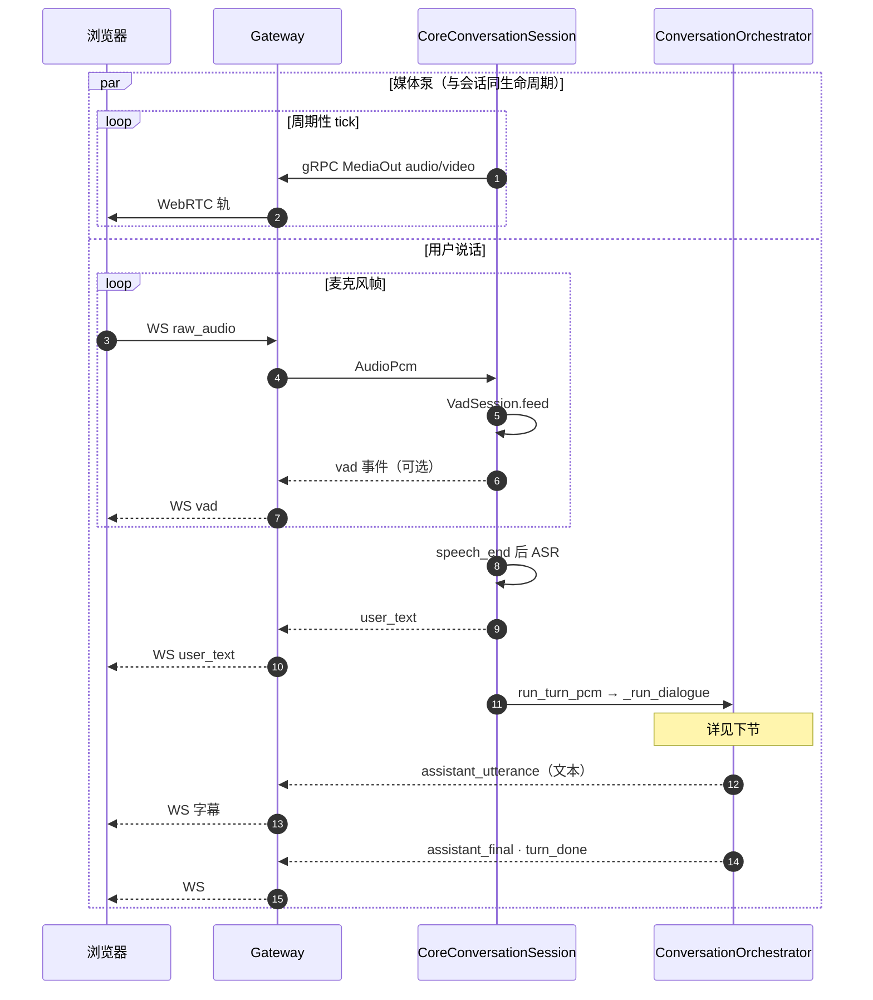
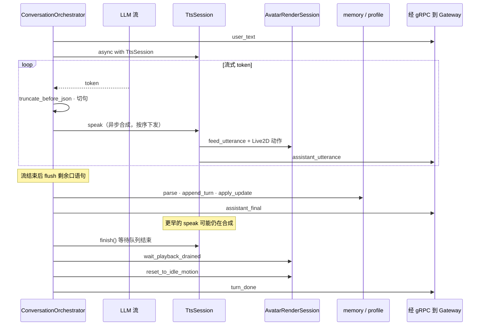

# virtual_videochat

虚拟人视频对话：**Gateway**（平台接入 / WebRTC / WebSocket）与 **Core**（对话编排 / Live2D 渲染 / 记忆 / 表单）为两个独立进程，经 `proto/vtuber/v1/core.proto` gRPC 双向流通信，**互不 import 对方业务代码**。

流程图基于当前实现，使用 [Mermaid](https://mermaid.js.org/)，可在 GitHub README 中直接渲染。

---

## 架构总览



| 组件 | 目录 | 职责 |
|------|------|------|
| **Core** | `backend/` | 会话、VAD/ASR/LLM/TTS、Avatar、用户数据 |
| **Core 资源 HTTP** | `backend/`（`assets_http.py`） | Live2D / `render-engine`，供 Playwright 拉取 |
| **Gateway** | `gateway/` | WS、WebRTC、转发 gRPC |
| **Web** | `web/` | 静态测试页；浏览器 **直连** Gateway 做 WS/WebRTC（不经 Web 进程转发） |

---

## 连接与鉴权（Web 测试端）



---

## 语音一轮（端到端）

虚拟人**声音与画面**经 **WebRTC** 下发；聊天区**字幕**经 WS `assistant_utterance`（仅文本）。



| 要点 | 说明 |
|------|------|
| 麦克风上行 | WS `raw_audio`，非 WebRTC 上行 |
| 虚拟人音视频 | Core 渲染 → gRPC `MediaOut` → Gateway → WebRTC |
| 表单与记忆 | Core 写 `profile_form.json`、`main.jsonl` |
| 文本输入 | WS `user_text` 可走同一套编排（跳过 ASR） |

---

## Core 内：一轮对话编排时序



---

## 用户数据（按 `user_id`）

目录：`data/users/{user_id}/`

| 文件 | 说明 |
|------|------|
| `profile_form.json` | 画像、当前话题、历史关注 |
| `main.jsonl` | 当日对话轮次 |

规则见 `prompts/profile_form_rules.md`。

---

## 快速启动

```bash
cp config.example.yaml config.yaml
# 编辑 config.yaml（API Key 等）
./start.sh
```

生成 gRPC 桩：`backend/.venv/bin/python scripts/gen_grpc.py`  
端口与环境变量见 `config.example.yaml`、`start.sh`。

---

## 目录结构

```
virtual_videochat/
├── proto/vtuber/v1/core.proto
├── gateway/
├── web/
├── assets/live2d/
├── render-engine/
└── backend/
    └── vtuber/core/
        ├── conversation_session.py
        └── orchestrator.py
```

---

## 扩展第三方平台

在 `gateway/` 增加会话适配，复用 `core_client.py`、`webrtc_egress.py`；Core 编排与 Avatar 逻辑保持不变。
